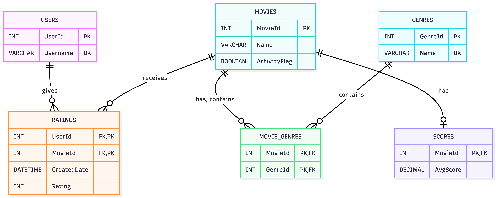

# ex603-movieTV-database
Colby Saxton

This is a Database for ex603 class for Movies/TV Shows.

This is a platform for a user to go into and create ratings for movies and view the aggregate scores for movies based on all ratings for that particular movie. This will also show a user the genre of a movie.

This will do that by creating a database schema with 5 different objects. First is a user which contains information about a user. Second is a movie. Third is a genre. Fourth is a movie genre connecting object. Fifth is a ratings object that allows a user to create a rating for a movie. See the ERD diagram below:

Formatting and Mermaid ERD diagram syntax was aided by Github Copilot Free version.
